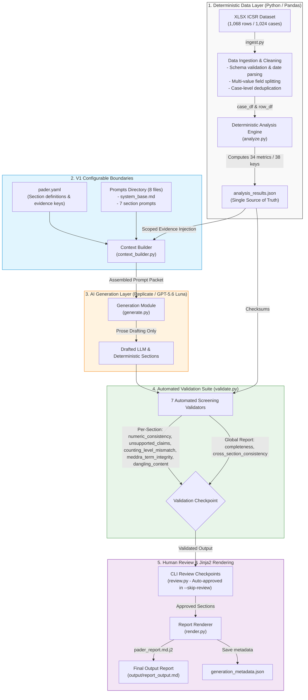

# Phera — GenAR V1 Pharmacovigilance Safety Report Pipeline

**Phera** is an enterprise-grade AI/Python hybrid pipeline that transforms raw adverse-event ICSR (Individual Case Safety Report) line-listings into structured, evidence-backed regulatory PADER (Periodic Adverse Drug Experience Report) documents for **Bisoprolol**, modeled on the structure and reporting logic of FDA 21 CFR 314.80 and ICH E2C guidelines.

---

## 1. Quick Start & Execution Guide

### Prerequisites
- Python 3.11+
- Replicate API Token (for LLM generation via `openai/gpt-5.6-luna`)

### Setup Instructions

```bash
# 1. Clone & create virtual environment
python -m venv venv
source venv/bin/activate  # On Windows: venv\Scripts\activate

# 2. Install dependencies
pip install -r requirements.txt

# 3. Configure API key
cp .env.example .env
# Edit .env and add your REPLICATE_API_TOKEN
```

### Commands to Run

```bash
# Regenerate the complete PADER report (Automated Mode)
python -m src.pipeline --report-type pader --skip-review

# Run full pipeline with interactive CLI Human Review checkpoints
python -m src.pipeline --report-type pader

# Analysis phase only (100% deterministic, no LLM calls)
python -m src.pipeline --report-type pader --analysis-only

# Execute full automated unit test suite (74+ tests)
pytest tests/ -v
```

---

## 2. Pipeline Architecture

The architecture enforces a strict separation between **deterministic computation** (Python/Pandas), **configurable boundaries** (YAML/Markdown), **AI prose generation** (LLM), **automated checksum validation**, and **human review**.



---

## 3. AI vs. Deterministic Split (Design Rationale)

Pharmacovigilance periodic safety reports submitted to regulatory agencies (FDA, EMA) require absolute quantitative precision. Mathematical hallucinations, altered patient totals, or inconsistent reaction splits can trigger regulatory audit failures.

| Component | Responsibility | Technology | Rationale |
| :--- | :--- | :--- | :--- |
| **Ingestion & Deduplication** | Parse ICSR lines, split comma-packed fields, deduplicate 1,068 rows into 1,024 unique cases | Python / `pandas` | Guarantees deterministic case identification and field isolation. |
| **Quantitative Analysis** | Computes 34 quantitative metric breakdowns across 38 total top-level keys (34 metrics + 4 administrative fields) | Python / `pandas` | **Zero LLM involvement.** LLMs are unreliable at arithmetic and aggregation; code is the single source of truth. |
| **Summary Tabulation & Case Index** | Render exact PT-level serious/non-serious tables and representative case listings | Python / Markdown | Tabular regulatory listings must match underlying database rows down to the exact integer. |
| **Regulatory Narrative Drafting** | Transform approved JSON evidence into formal third-person regulatory text | Replicate (`openai/gpt-5.6-luna`) | LLMs excel at drafting clear, professional prose while adhering to strict negative formatting constraints. |
| **Validation & Cross-Section Auditing** | Verify numeric agreement, MedDRA spelling, cross-section sums, and claim boundaries | Python / RegEx | Automated guards verify AI outputs against evidence before human sign-off. |

> [!IMPORTANT]
> **Core Principle:** *Python computes, LLM phrases.* The LLM is never allowed to calculate, aggregate, or infer numbers. It only receives pre-computed, approved evidence.

---

## 4. Prompt & Context Template Assembly

Prompts are assembled dynamically without hardcoded text strings in Python. The system merges three distinct layers:

1. **System Base Prompt (`src/config/prompts/system_base.md`)**: Defines global regulatory persona, third-person neutral tone, MedDRA preservation rules, and strict negative constraints.
2. **Section Instruction Prompts (`src/config/prompts/*.md`)**: All 8 prompt files are present in `src/config/prompts/`:
   - `system_base.md` — Global regulatory grounding rules
   - `reporting_period.md` — Introduction section instruction
   - `case_summary.md` — Summary Analysis of Cases instruction
   - `reaction_analysis.md` — Reaction/Adverse Event Analysis instruction
   - `trends.md` — Trends and Important Observations instruction
   - `serious_cases.md` — Serious Cases / 15-Day Alerts instruction (with truncation disclaimer)
   - `history_of_actions.md` — History of Actions instruction
   - `narrative_summary.md` — Narrative Summary and Analysis instruction
3. **Scoped Evidence Packet (JSON)**: Injects *only* the JSON metrics declared in `src/config/report_types/pader.yaml` for that specific section.

### Assembled Prompt Example (`reaction_analysis`)

```markdown
You are drafting one section of a regulatory PADER safety report.

Rules:
- Use ONLY the figures given in "Approved analysis results."
- Never invent, estimate, or recompute a number.
- All MedDRA Preferred Terms must be reproduced exactly as provided in the evidence.
- Target length: 150-250 words.

Section: Reaction/Adverse Event Analysis

Report the most frequently reported reactions and the most frequently reported serious reactions, using the supplied counts.
Compare overall vs. serious reaction counts and note where they overlap.

Approved analysis results:
{
  "top_reactions": {
    "Acute kidney injury": 80,
    "Drug ineffective": 54,
    "Bradycardia": 37,
    "Dyspnoea": 35
  },
  "top_serious_reactions": {
    "Acute kidney injury": 80,
    "Drug ineffective": 53,
    "Bradycardia": 37
  },
  "reaction_counting_method": "case_level_deduplicated"
}
```

---

## 5. Grounding & Anti-Hallucination Mechanisms

Phera implements a 7-check automated validation suite (`src/validate.py`) to guarantee that every generated sentence is strictly backed by source data:

### Per-Section Validation Checks (Stored in `generation_metadata.json` under `sections[].checks`)
1. **`numeric_consistency`**: Extracts integers, decimals, and percentages from text and verifies them against the section's evidence packet (includes comma normalization `1,024` == `1024` and regulatory citation exemptions like `21 CFR 314.80`).
2. **`unsupported_claims`**: Flags unevidenced conclusion language (e.g. "no safety concern", "potential signal", "causally related").
3. **`counting_level_mismatch`**: Semantic, config-driven validator that checks case-level vs. occurrence frequency labeling and verifies claims like *"80 cases experienced Acute kidney injury"* against verified evidence counts.
4. **`meddra_term_integrity`**: Scans text for typos or illegal space-splits in Preferred Terms (e.g., `Bradi cardia`, `Brdycardia`).
5. **`dangling_content`**: Detects unclosed bullet points or incomplete case records.

### Global Report-Level Checks (Stored in `generation_metadata.json` under `validation`)
6. **`completeness`**: Verifies every required report section is present and non-empty.
7. **`cross_section_consistency`**: Checks mathematical invariants across independently generated sections (e.g. verifying $\text{Serious PT Count} + \text{Non-Serious PT Count} == \text{Total PT Count}$ for all 50 Preferred Terms in the Summary Tabulation).

All validation outcomes are serialized into `output/generation_metadata.json` for full auditability.

---

## 6. Evaluating at Scale (1,000+ Reports)

To scale evaluation across thousands of generated safety reports without manual review bottlenecking, we propose a 4-tier automated evaluation framework:

```
[1,000 ICSR Datasets] ──► [Phera Pipeline] ──► [Generated PADER Reports]
                                                      │
         ┌────────────────────────────────────────────┴────────────────────────────────────────────┐
         ▼                                            ▼                                            ▼
[Tier 1: Deterministic Checksums]          [Tier 2: Perturbation Benchmarks]              [Tier 3: LLM-as-a-Judge]
- 100% Numeric Precision Rate              - Edge-case synthetic datasets                 - GPT-4o Regulatory Judge
- MedDRA PT Exact Match Rate               - Omitted columns / dirty date tests           - Tone & Completeness Rubric
- Cross-Section Sum Invariants             - Stress-testing boundary behavior             - Negative constraint check
```

1. **Tier 1: Automated Deterministic Checksum Suite**: Execute headless assertion checks across all 1,000 outputs:
   - **Numeric Grounding Score:** % of numbers in text present in JSON evidence (target: 100%).
   - **Cross-Section Checksum Rate:** % of reports passing PT-level arithmetic invariants (target: 100%).
   - **MedDRA Preservation Index:** Zero unauthorized PT mutations or split words.
2. **Tier 2: Synthetic Data Perturbation Benchmarks**: Generate 100 synthetic ICSR datasets with edge cases (e.g., 0 serious cases, 100% missing age fields, single-reaction datasets, noisy date strings) to stress-test pipeline stability.
3. **Tier 3: LLM-as-a-Judge Regulatory Audit**: Deploy an independent auditor model (e.g., GPT-4o) prompted with an FDA regulatory review rubric to grade tone neutrality, absence of unevidenced causal claims, and paragraph structure.
4. **Tier 4: Drift & Performance Analytics**: Monitor token latency, generation cost, and validation warning/failure distributions across report runs over time.

---

## 7. Known Limitations & Production Roadmap

| Limitation | Impact | Production Resolution Plan |
| :--- | :--- | :--- |
| **System Organ Class (SOC) Mapping** | Source dataset contains MedDRA Preferred Terms (PT) but lacks SOC hierarchy. | Integrate official MedDRA API/dictionary lookup table to map PTs to their corresponding SOCs (e.g., *Cardiac disorders*). |
| **15-Day Alert Listedness Determination** | 15-day Alert status requires evaluating if serious events are "unlisted" (unexpected). Unlistedness requires a Company Core Data Sheet (CCDS) or USPI label. | Integrate automated CCDS / Package Insert ingestion module to evaluate expectedness per PT. Currently, the report explicitly notes that listedness is unavailable without a label. |
| **Multi-Product Causality Attribution** | Dataset assumes single-suspect-product reporting (Bisoprolol). | Expand `ingest.py` schema parser to process co-suspect, concomitant, and interacting secondary drugs. |
| **CLI to Web-Based Human Review Portal** | Human review checkpoints currently run in terminal CLI (`src/review.py`). | Replace CLI review prompts with a React/Next.js review web dashboard featuring side-by-side evidence diffs and single-click section sign-offs. |

---

## 8. Repository Structure

```
.
├── src/
│   ├── analyze.py           # Deterministic analysis engine (34 metrics across 38 top-level keys)
│   ├── config/              # V1 configurable instructions & definitions
│   │   ├── report_types/
│   │   │   └── pader.yaml   # PADER section definitions & evidence keys
│   │   └── prompts/         # All 8 Markdown system & section prompt files
│   ├── context_builder.py   # Scoped evidence packet builder
│   ├── generate.py          # LLM interface & deterministic renderers
│   ├── ingest.py            # Dataset loading, cleaning & deduplication
│   ├── pipeline.py          # 8-step pipeline orchestrator CLI
│   ├── render.py            # Jinja2 report renderer
│   ├── review.py            # Interactive CLI human review checkpoints
│   └── validate.py          # 7-check automated validation suite
├── templates/
│   └── pader_report.md.j2   # Jinja2 report template
├── tests/                   # 74+ unit & integration tests
├── output/                  # Generated reports, metrics, & metadata
├── docs/                    # Challenge documentation & submission guide
├── requirements.txt         # Project dependencies
└── README.md                # Submission documentation
```
